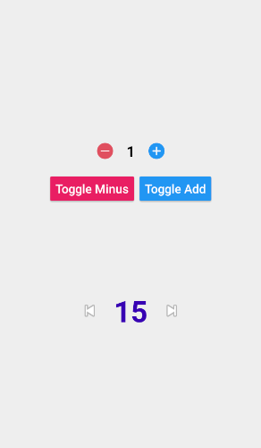

# Quantity-View
highly Customizable Quantity View for android:




## Including in your project
[](https://jitpack.io/#EsmaeelNabil/Quantity-View-Android)

### Gradle
Add below codes to your **root** `build.gradle` file (not your module build.gradle file).

```gradle
allprojects {
    repositories {

    ....

	maven { url 'https://jitpack.io' }
	
    }
}
```
And add a dependency code to your **APP**'s `build.gradle` file. [](https://jitpack.io/#EsmaeelNabil/Quantity-View-Android)
```gradle
dependencies {

	  implementation 'com.github.EsmaeelNabil:Quantity-View-Android:1.0'

}
```

## Usage

Add following XML inside your XML layout file.

### Quantity-View XML

```gradle
    <com.esmaeel.addMinusLibrary.QuantityView
        android:id="@+id/quantityView"
        android:layout_width="wrap_content"
        android:layout_height="wrap_content"
        app:addDrawable="@android:drawable/ic_media_next"
        app:currentQuantity="15"
        app:maxQuantity="20"
        app:minQuantity="2"
        app:minusDrawable="@android:drawable/ic_media_previous"
        app:numberColor="@color/colorPrimaryDark"
        app:numberTextSize="16sp" />

```

# implementaion

### setting `listeners` for values changes

```gradle
        quantityView.setListeners(object : QuantityView.QuantityViewContract {
            override fun onAdd(oldValue: Int, newValue: Int) {
                binder.txt1.text = "add ::-->> old is : $oldValue -- new is : $newValue"
            }

            override fun onMinus(oldValue: Int, newValue: Int) {
                binder.txt1.text = "minus ::-->> old is : $oldValue -- new is : $newValue"
            }

            override fun onReset() {
                binder.txt1.text = "Reset"
            }

        })

```

### Disable or enable add or minus

```kotlin
        quantityView?.addIsDisabled = false

        quantityView?.minusIsDisabled = true
```

### Bind two views with each others with `Sum` value
- adding will be processed regarding the sum of the two view's values
- pseudo code of what happens :> canAdd =  if ( viewOneValue + viewTwoValue ) < `Sum`

```kotlin
        binder.quantityView.bindSumWith(binder.quantityView2,20)
```

# Attribues you can use in XML

```gradle

        name="numberColor"        ------->      color
        name="numberTextSize"     ------->      sp/ssp font size
        name="addDrawable"        ------->      drawable reference
        name="minusDrawable"      ------->      drawable reference
        name="minQuantity"        ------->      Int
        name="maxQuantity"        ------->      Int
        name="currentQuantity"    ------->      Int
                
```
